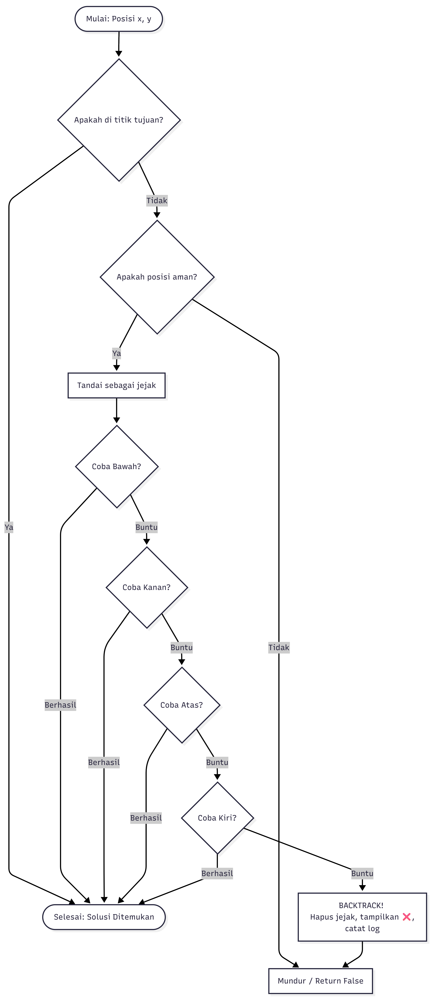

# Tugas Individu: Algoritma Backtracking - Rat in a Maze

Muhammad Zhorif Zaidaan Ramadhan  
21120124140140  
Algoritma Pemrograman kelas C  

Repositori ini berisi implementasi algoritma **Backtracking** dalam bahasa Python untuk menyelesaikan problem klasik *Rat in a Maze*. Program ini dilengkapi dengan visualisasi *Command Line Interface* (CLI) interaktif menggunakan karakter emoji untuk menunjukkan langkah demi langkah penyelesaian masalah secara *real-time*.

## Deskripsi Program
Program akan menghasilkan labirin (maze) berukuran 12x12 secara acak. Tikus akan memulai perjalanan dari pintu masuk di pojok kiri atas `(0,0)` dan harus mencari jalan keluar di pojok kanan bawah `(11,11)` dengan menghindari rintangan.

**Keterangan Visualisasi CLI:**
* 🐀 **Tikus Hitam:** Posisi terkini tikus saat menelusuri labirin.
* 🐁 **Tikus Putih:** Lintasan atau jejak aman yang telah dilalui tikus.
* 🌳 **Pohon:** Rintangan atau jalan buntu.
* 🧱 **Bata:** Dinding batas labirin.
* ❌ **Tanda Silang:** Indikator visual ketika tikus menabrak jalan buntu dan harus melakukan *backtracking*.

**Fitur Tambahan:**
1. **Penghitung Backtrack:** Menampilkan jumlah total tikus terpaksa mundur (*backtrack*) untuk mencari rute lain.
2. **Log Koordinat:** Menampilkan daftar riwayat 5 titik koordinat terakhir tempat terjadinya *backtracking*.

## Cara Kerja Sistem
Sistem ini menggunakan algoritma **Backtracking** (pencarian rekursif) untuk menelusuri jalan keluar. Berikut adalah alur kerjanya:
1. **Inisialisasi:** Program menghasilkan area labirin berukuran 12x12. Tikus ditempatkan di titik awal `(0, 0)`.
2. **Eksplorasi (Maju):** Tikus mengecek arah yang bisa dilalui secara berurutan dengan prioritas: **Bawah ➡️ Kanan ➡️ Atas ➡️ Kiri**. Jika arah tersebut aman (bukan rintangan/luar batas), tikus akan pindah ke titik tersebut dan menandainya sebagai lintasan (🐁).
3. **Backtracking (Mundur):** Jika tikus tiba di sebuah sel di mana keempat arah di sekitarnya tertutup (berupa pohon, dinding batas, atau jalan yang sudah pernah dilewati), tikus akan mendeteksi itu sebagai **jalan buntu**. Sistem akan mencatat lokasi ini ke dalam log, menampilkan tanda ❌ sesaat, lalu tikus akan **mundur** ke kotak/persimpangan sebelumnya sambil menghapus jejak jalannya.
4. **Mencari Alternatif:** Dari persimpangan sebelumnya tersebut, tikus akan mencoba urutan arah lain yang belum dieksplorasi.
5. **Penyelesaian:** Proses penelusuran dan *backtracking* ini diulang terus-menerus hingga tikus mencapai titik tujuan `(11, 11)` (Berhasil menemukan jalan keluar), atau hingga tikus mundur kembali ke titik awal dan menyadari tidak ada satu pun rute yang tersisa (Buntu total).

## Flowchart Algoritma


## Cara Menjalankan Program
1. Pastikan Python sudah terinstal di komputer.
2. Buka terminal (Command Prompt / PowerShell / VS Code Terminal).
3. Arahkan ke direktori tempat file disimpan.
4. Jalankan perintah berikut:
   ```bash
   python rat_maze.py
   ```

## Pseudo Code
```text
Fungsi solve_maze_util(maze, x, y, n):
    1. JIKA posisi (x, y) adalah titik tujuan (n-1, n-1) DAN jalan kosong:
        Tandai (x, y) sebagai jejak tikus
        Tampilkan visualisasi maze ke CLI
        KEMBALIKAN Benar (True)

    2. JIKA posisi (x, y) aman (berada di dalam kotak DAN bukan rintangan):
        Tandai (x, y) sebagai jejak tikus
        Tampilkan visualisasi maze ke CLI

        a. Coba bergerak ke BAWAH: solve_maze_util(maze, x+1, y, n)
           JIKA berhasil, KEMBALIKAN Benar
        
        b. Coba bergerak ke KANAN: solve_maze_util(maze, x, y+1, n)
           JIKA berhasil, KEMBALIKAN Benar
        
        c. Coba bergerak ke ATAS: solve_maze_util(maze, x-1, y, n)
           JIKA berhasil, KEMBALIKAN Benar
        
        d. Coba bergerak ke KIRI: solve_maze_util(maze, x, y-1, n)
           JIKA berhasil, KEMBALIKAN Benar

        3. MOMEN BACKTRACKING (Jika semua arah di atas buntu):
           Tambahkan 1 ke statistik jumlah_backtrack
           Catat log lokasi buntu di (x, y)
           Tampilkan visualisasi maze dengan indikator ❌ (buntu)
           Hapus jejak di (x, y) kembali menjadi jalan kosong
           KEMBALIKAN Salah (False)

    4. KEMBALIKAN Salah (False)
``` 
